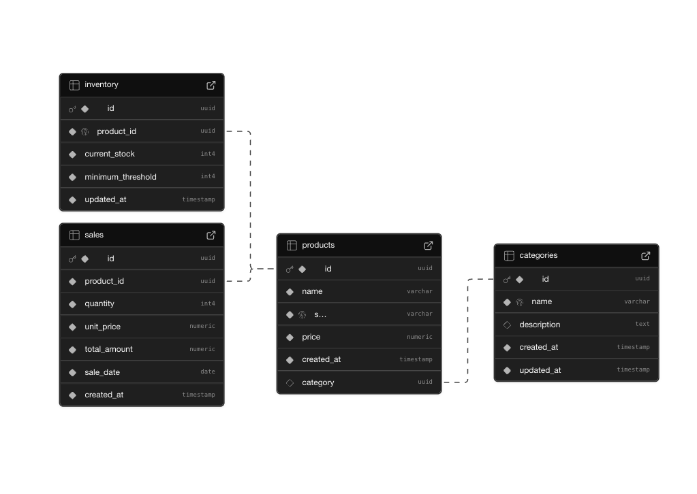

# E-commerce Admin API

## 🔗 Quick Links

[](https://forsit-task.onrender.com)
[](https://github.com/Mohamad-hammad/forsit-task)

⚠️ **IMPORTANT NOTES** ⚠️

```
Database seeding is only required if you're running the application locally. 
The production database is already seeded.

The first request to the API might take a few seconds to respond as the Render 
instance wakes up from sleep mode after a period of inactivity.
```

A backend app for managing inventory, products, categories, and sales built with Node.js, Express.js, and TypeScript.

## Technology Stack

- **Programming Language**: TypeScript
- **Framework**: Node.js with Express.js
- **API Type**: RESTful API
- **Database**: (Supbase)PostgreSQL with TypeORM

## Prerequisites

- Node.js (v14 or higher)
- PostgreSQL
- npm or yarn package manager

## Setup Instructions

1. Clone the repository:
```bash
git clone https://github.com/Mohamad-hammad/forsit-task
cd forsit-task
```

2. Install dependencies:
```bash
npm install
```

3. Create a `.env` file in the root directory with the following variables:
```env
DB_HOST=localhost
DB_PORT=5432
DB_USER=your_username
DB_PASSWORD=your_password
DB_NAME=your_database_name
```

4. Build the project:
```bash
npm run build
```

5. Start the server:
```bash
npm start
```

For development with hot-reload:
```bash
npm run dev
```

## Database Schema

The application uses PostgreSQL with the following schema:

### Category
- Purpose: Stores product categories for organizing and filtering products
- Each category can have multiple products (One-to-Many relationship)
- Fields:
  - `id`: Primary Key (UUID)
  - `name`: String
  - `description`: String
  - `createdAt`: Timestamp
  - `updatedAt`: Timestamp

### Product
- Purpose: Central entity storing all product information
- Links products to categories and connects with inventory and sales
- Fields:
  - `id`: Primary Key (UUID)
  - `name`: String
  - `description`: String
  - `price`: Decimal
  - `categoryId`: Foreign Key (References Category)
  - `createdAt`: Timestamp
  - `updatedAt`: Timestamp

### Inventory
- Purpose: Tracks stock levels and manages inventory for each product
- One-to-one relationship with products for stock management
- Fields:
  - `id`: Primary Key (UUID)
  - `productId`: Foreign Key (References Product)
  - `quantity`: Integer
  - `createdAt`: Timestamp
  - `updatedAt`: Timestamp

### Sale
- Purpose: Records all sales transactions and revenue data
- Links sales to products for tracking and analysis
- Fields:
  - `id`: Primary Key (UUID)
  - `productId`: Foreign Key (References Product)
  - `quantity`: Integer
  - `totalAmount`: Decimal
  - `createdAt`: Timestamp
  - `updatedAt`: Timestamp

## API Endpoints

### Database Seeding
- `POST /api/seeding` - Seed the database with initial data
  - Description: Populates the database with sample categories, products, inventory items, and sales records
  - Response: Returns the count of seeded records for each entity (categories, products, inventory, sales)

### Categories
- `POST /api/categories` - Create a new category
  - Required fields: name
  - Optional fields: description
  - Response: Returns the created category with success status

### Products
- `POST /api/products` - Create a new product
  - Required fields: name, sku, price
  - Optional fields: category
  - Response: Returns the created product with success status

### Inventory
- `POST /api/inventory` - Create a new inventory item
  - Required fields: product_id, current_stock
  - Optional fields: minimum_threshold
  - Response: Returns the created inventory item with success status
- `GET /api/inventory` - Get all inventory items with filtering and pagination
  - Query parameters:
    - page: Page number (default: 1)
    - limit: Items per page
    - categoryId: Filter by category
    - sortBy: Field to sort by
    - sortOrder: ASC or DESC
  - Response: Returns paginated inventory items with metadata
  - Example: `http://localhost:3000/api/inventory?page=1&limit=10`
- `GET /api/inventory/alerts` - Get inventory items with low stock alerts
  - Query parameters:
    - page: Page number
    - limit: Items per page
    - categoryId: Filter by category
  - Response: Returns paginated inventory alerts with metadata
  - Example: `http://localhost:3000/api/inventory/alerts?page=1&limit=10&categoryId=123`
- `PATCH /api/inventory/:id` - Update inventory item
  - Fields: current_stock, minimum_threshold
  - Response: Returns the updated inventory item with success status

### Sales
- `POST /api/sales` - Create a new sale
  - Required fields: product_id, quantity, unit_price, total_amount, sale_date
  - Response: Returns the created sale with success status
- `GET /api/sales` - Get all sales with filtering and pagination
  - Query parameters:
    - startDate: Filter by start date (YYYY-MM-DD)
    - endDate: Filter by end date (YYYY-MM-DD)
    - productId: Filter by product
    - categoryId: Filter by category
    - page: Page number
    - limit: Items per page
  - Response: Returns paginated sales with metadata
  - Example: `GET /api/sales?startDate=2024-01-01&endDate=2024-03-31&productId=123&categoryId=456&page=1&limit=10`
- `GET /api/sales/revenue/daily` - Get daily revenue report
  - Query parameters:
    - startDate: Start date (YYYY-MM-DD)
    - endDate: End date (YYYY-MM-DD)
    - productId: Filter by product
    - categoryId: Filter by category
  - Response: Returns daily revenue data
  - Example: 
    ```bash
    curl -X GET "http://localhost:3000/api/sales/revenue/daily?startDate=2024-01-01&endDate=2024-03-31" \
    -H "Content-Type: application/json"
    ```
- `GET /api/sales/revenue/weekly` - Get weekly revenue report
  - Query parameters: Same as daily revenue
  - Response: Returns weekly revenue data
  - Example: `http://localhost:3000/api/sales/revenue/weekly?startDate=2024-01-01&endDate=2024-01-31`
- `GET /api/sales/revenue/monthly` - Get monthly revenue report
  - Query parameters: Same as daily revenue
  - Response: Returns monthly revenue data
  - Example: `http://localhost:3000/api/sales/revenue/monthly?startDate=2024-01-01&endDate=2024-12-31`
- `GET /api/sales/revenue/annual` - Get annual revenue report
  - Query parameters: Same as daily revenue
  - Response: Returns annual revenue data
  - Example: `http://localhost:3000/api/sales/revenue/annual?startDate=2020-01-01&endDate=2024-12-31`
- `GET /api/sales/revenue/compare` - Compare revenue between two periods
  - Query parameters:
    - period1Start: Start date of first period (YYYY-MM-DD)
    - period1End: End date of first period (YYYY-MM-DD)
    - period2Start: Start date of second period (YYYY-MM-DD)
    - period2End: End date of second period (YYYY-MM-DD)
  - Response: Returns revenue comparison data between the two periods
  - Example: `http://localhost:3000/api/sales/revenue/compare?period1Start=2024-01-01&period1End=2024-03-31&period2Start=2024-04-01&period2End=2024-06-30`
- `GET /api/sales/revenue/compare/categories` - Compare revenue across categories
  - Query parameters:
    - startDate: Start date (YYYY-MM-DD)
    - endDate: End date (YYYY-MM-DD)
    - categoryIds: Comma-separated list of category IDs
  - Response: Returns revenue comparison data between specified categories
  - Example: `http://localhost:3000/api/sales/revenue/compare/categories?startDate=2024-01-01&endDate=2024-12-31&categoryIds=1,2,3`

## Database Relationships

- A Category can have multiple Products (One-to-Many)
- A Product belongs to one Category (Many-to-One)
- A Product has one Inventory record (One-to-One)
- A Product can have multiple Sales (One-to-Many)

## Database Schema




